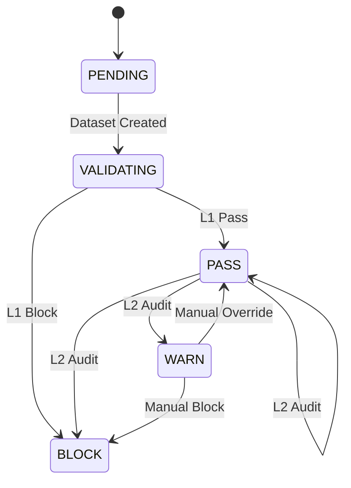
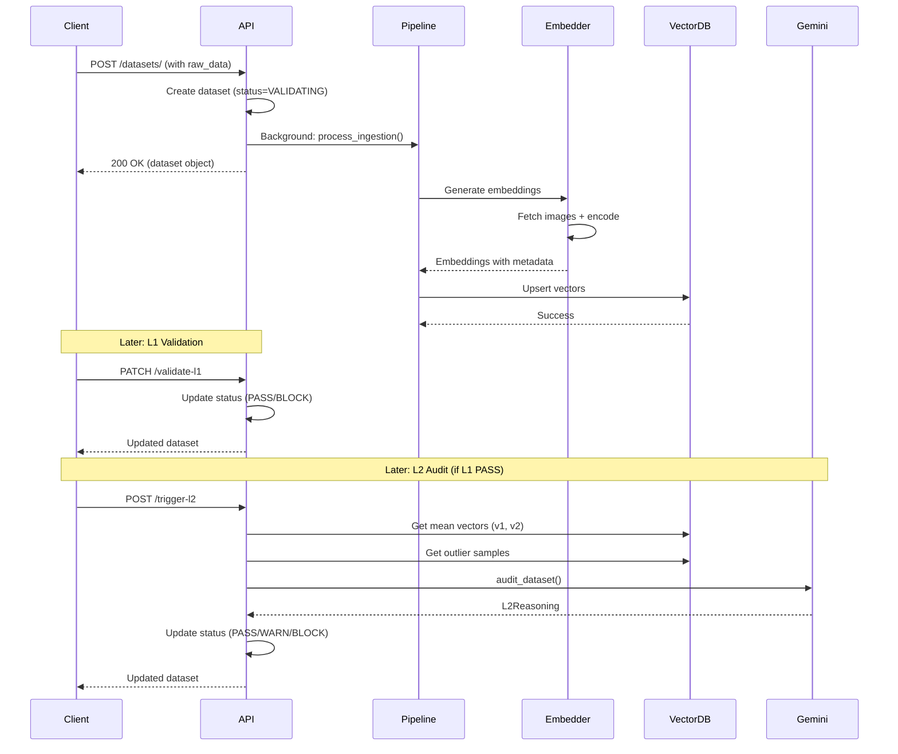

# AlignOps Control Plane API Specification

## Overview

The AlignOps API provides a comprehensive dataset validation and quality control system with three layers of validation:
- **L1 (Rules-based)**: Schema, volume, and freshness checks
- **L2 (Semantic)**: AI-powered semantic drift and alignment analysis using Gemini
- **MANUAL**: Human override capabilities

**Base URL**: `http://localhost:8000`

---

## Data Models

### StatusEnum

```typescript
type StatusEnum = 
  | "PENDING"
  | "VALIDATING" 
  | "PASS"
  | "WARN"
  | "BLOCK"
```

**Status Transition Policy**:
- L1 BLOCK: Final block at rule-level. L2 must not override it.
- L1 PASS: Can proceed to L2 auditing.
- L2 WARN: Requires human-in-the-loop decision.
- L2 BLOCK: Blocked by semantic audit.
- MANUAL PASS: Human override to PASS when needed.



### L1Report

```typescript
interface L1Report {
  schema_passed: boolean;
  volume_actual: number;
  volume_expected: number;
  freshness_delay_sec: number;
  l1_status: StatusEnum;
  details?: Record<string, any>;
}
```

### ReasoningTrace

```typescript
interface ReasoningTrace {
  summary: string;
  key_observations: string[];
  decision_rationale: string;
  recommended_action?: string;
}
```

### L2Reasoning

```typescript
interface L2Reasoning {
  model_name: string; // e.g., "gemini-2.5-flash"
  distribution_drift: {
    cosine_mean_shift: number;
    [key: string]: number;
  };
  reasoning_trace: ReasoningTrace;
  judgment_summary: string;
  flagged_samples: string[];
  confidence_score: number; // 0.0 to 1.0
  l2_status: StatusEnum;
}
```

### StatusHistoryItem

```typescript
interface StatusHistoryItem {
  status: StatusEnum;
  source: "SYSTEM" | "L1" | "L2" | "MANUAL";
  timestamp: string; // ISO 8601 datetime
  reason?: string;
}
```

### DatasetObject

```typescript
interface DatasetObject {
  dataset_id: string;
  version: string;
  created_at: string; // ISO 8601 datetime
  
  status: StatusEnum;
  status_source?: "SYSTEM" | "L1" | "L2" | "MANUAL";
  status_history: StatusHistoryItem[];
  
  l1_report?: L1Report;
  l2_reasoning?: L2Reasoning;
  
  source_id: string;
  lineage_parent_version?: string;
  tags: string[];
}
```

---

## Endpoints

### 1. List All Datasets

**GET** `/datasets/`

Returns all datasets with their latest version information.

**Response**: `200 OK`

```json
[
  {
    "dataset_id": "sdv-vision",
    "latest_version": "v2",
    "status": "BLOCK",
    "status_source": "L2",
    "last_evaluated": "2026-02-08T10:30:00Z",
    "total_versions": 2
  }
]
```

---

### 2. Create Dataset Version

**POST** `/datasets/`

Creates a new dataset version and starts background ingestion.

**Request Body**:

```json
{
  "dataset": {
    "dataset_id": "sdv-vision",
    "version": "v1",
    "source_id": "camera-01",
    "tags": ["production", "autonomous-driving"]
  },
  "raw_data": [
    {
      "image_url": "https://example.com/image1.jpg",
      "caption": "A sunny day on the highway",
      "source_id": "camera-01"
    }
  ]
}
```

**Response**: `200 OK`

```json
{
  "dataset_id": "sdv-vision",
  "version": "v1",
  "created_at": "2026-02-08T10:00:00Z",
  "status": "VALIDATING",
  "status_source": "SYSTEM",
  "status_history": [
    {
      "status": "VALIDATING",
      "source": "SYSTEM",
      "timestamp": "2026-02-08T10:00:00Z",
      "reason": "Dataset version created"
    }
  ],
  "source_id": "camera-01",
  "tags": ["production", "autonomous-driving"]
}
```

**Errors**:
- `400 Bad Request`: Version already exists

---

### 3. List Dataset Versions

**GET** `/datasets/{dataset_id}`

Returns all versions for a specific dataset.

**Path Parameters**:
- `dataset_id` (string): Dataset identifier

**Response**: `200 OK`

```json
[
  {
    "dataset_id": "sdv-vision",
    "version": "v1",
    "created_at": "2026-02-07T10:00:00Z",
    "status": "PASS",
    "status_source": "L1",
    "status_history": [...],
    "l1_report": {...},
    "source_id": "camera-01",
    "tags": ["production"]
  },
  {
    "dataset_id": "sdv-vision",
    "version": "v2",
    "created_at": "2026-02-08T10:00:00Z",
    "status": "BLOCK",
    "status_source": "L2",
    "status_history": [...],
    "l1_report": {...},
    "l2_reasoning": {...},
    "source_id": "camera-01",
    "lineage_parent_version": "v1",
    "tags": ["production"]
  }
]
```

**Errors**:
- `404 Not Found`: Dataset not found

---

### 4. Update L1 Validation Result

**PATCH** `/datasets/{dataset_id}/v/{version}/validate-l1`

Updates the L1 validation report for a dataset version.

**Path Parameters**:
- `dataset_id` (string): Dataset identifier
- `version` (string): Version identifier

**Request Body**:

```json
{
  "schema_passed": true,
  "volume_actual": 1000,
  "volume_expected": 1000,
  "freshness_delay_sec": 120,
  "l1_status": "PASS",
  "details": {}
}
```

**Response**: `200 OK`

Returns the updated `DatasetObject`.

**Errors**:
- `404 Not Found`: Dataset version not found

---

### 5. Update L2 Audit Result

**PATCH** `/datasets/{dataset_id}/v/{version}/audit-l2`

Updates the L2 semantic audit result for a dataset version.

**Path Parameters**:
- `dataset_id` (string): Dataset identifier
- `version` (string): Version identifier

**Request Body**:

```json
{
  "model_name": "gemini-2.5-flash",
  "distribution_drift": {
    "cosine_mean_shift": 0.34
  },
  "reasoning_trace": {
    "summary": "Significant semantic drift detected",
    "key_observations": [
      "Caption-image misalignment in lighting conditions",
      "15% of samples show daytime captions with nighttime images"
    ],
    "decision_rationale": "The cosine shift of 0.34 exceeds threshold, and manual inspection confirms systematic caption-image mismatch",
    "recommended_action": "Review source camera-04 timestamp configuration"
  },
  "judgment_summary": "BLOCK recommended due to systematic caption-image misalignment",
  "flagged_samples": ["sample_001", "sample_045", "sample_089"],
  "confidence_score": 0.92,
  "l2_status": "BLOCK"
}
```

**Response**: `200 OK`

Returns the updated `DatasetObject`.

**Errors**:
- `404 Not Found`: Dataset version not found
- `400 Bad Request`: Blocked by L1 (cannot audit if L1 blocked)

---

### 6. Trigger L2 Audit

**POST** `/datasets/{dataset_id}/v/{version}/trigger-l2`

Triggers an L2 semantic audit by comparing with the previous version.

**Path Parameters**:
- `dataset_id` (string): Dataset identifier
- `version` (string): Version identifier (currently only supports "v2")

**Response**: `200 OK`

Returns the updated `DatasetObject` with L2 reasoning.

**Errors**:
- `404 Not Found`: Dataset version not found
- `400 Bad Request`: 
  - Only supports version v2
  - Missing vector data (both v1 and v2 must exist in Qdrant)
  - Need at least 3 outlier samples for L2 audit

**Process Flow**:
1. Retrieves mean vectors for v1 and v2 from Qdrant
2. Calculates cosine distance between mean vectors
3. Identifies top 5 outlier samples (furthest from both means)
4. Sends drift statistics and outlier samples to Gemini for analysis
5. Updates dataset with L2 reasoning and status

---

## Error Responses

All error responses follow this format:

```json
{
  "detail": "Error message describing what went wrong"
}
```

**Common HTTP Status Codes**:
- `200 OK`: Request succeeded
- `400 Bad Request`: Invalid request parameters or business logic violation
- `404 Not Found`: Resource not found
- `500 Internal Server Error`: Server error

---

## Data Flow

### Ingestion Pipeline



---

## Usage Examples

### Example 1: Creating and Validating a Dataset

```bash
# Step 1: Create dataset version
curl -X POST http://localhost:8000/datasets/ \
  -H "Content-Type: application/json" \
  -d '{
    "dataset": {
      "dataset_id": "test-dataset",
      "version": "v1",
      "source_id": "test-source"
    },
    "raw_data": [...]
  }'

# Step 2: Wait for ingestion to complete, then validate L1
curl -X PATCH http://localhost:8000/datasets/test-dataset/v/v1/validate-l1 \
  -H "Content-Type: application/json" \
  -d '{
    "schema_passed": true,
    "volume_actual": 100,
    "volume_expected": 100,
    "freshness_delay_sec": 60,
    "l1_status": "PASS"
  }'

# Step 3: Create v2 and trigger L2 audit
curl -X POST http://localhost:8000/datasets/test-dataset/v/v2/trigger-l2
```

### Example 2: Listing All Datasets

```bash
curl http://localhost:8000/datasets/
```

### Example 3: Getting Version History

```bash
curl http://localhost:8000/datasets/test-dataset
```

---

## Notes

- All timestamps are in ISO 8601 format with UTC timezone
- The API uses FastAPI with automatic OpenAPI documentation at `/docs`
- Background tasks are used for long-running ingestion processes
- Vector embeddings are stored in Qdrant (default: `http://qdrant:6333`)
- L2 audits require the `GEMINI_API_KEY` environment variable to be set

